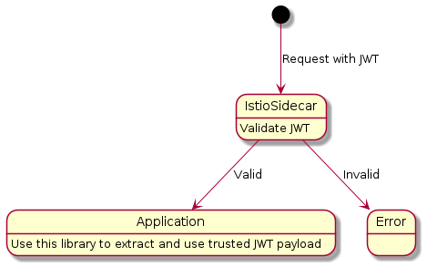

# JWT Payload Extractor


[](https://codecov.io/gh/php-istio/jwt-payload-extractor)
[](https://packagist.org/packages/php-istio/jwt-payload-extractor)

## About

This library help to extract trusted JWT payload from request forwarded by Istio Sidecar. It's based
on [PSR-7 Server Request Message](https://www.php-fig.org/psr/psr-7/) ensures interoperability with other packages and
frameworks.



## Requirements

PHP versions:

+ PHP 8.0

## Installation

First install this library:

```shell
composer require php-istio/jwt-payload-extractor
```

And choice one of PSR-7 implementation package (ex: [nyholm/psr7-server](https://github.com/Nyholm/psr7-server/)):

```shell
composer require nyholm/psr7 nyholm/psr7-server
```

## Usage

Istio [JWTRules](https://istio.io/latest/docs/reference/config/security/jwt/#JWTRule) part of [RequestAuthentication](https://istio.io/latest/docs/reference/config/security/request_authentication/) CRD (Custom Resource Definition) support forward origin
token (`forwardOriginalToken` option), or just only base64 payload via specify header name
(`outputPayloadToHeader` option), depend on your strategy you need to select method to extract your trusted JWT payload from forwarded request:

+ Extract from origin token in header:

```php
<?php
$psr17Factory = new \Nyholm\Psr7\Factory\Psr17Factory();

$creator = new \Nyholm\Psr7Server\ServerRequestCreator(
    $psr17Factory, // ServerRequestFactory
    $psr17Factory, // UriFactory
    $psr17Factory, // UploadedFileFactory
    $psr17Factory  // StreamFactory
);

$serverRequest = $creator->fromGlobals();
$extractor = \Istio\JWTPayloadExtractor\ExtractorFactory::fromOriginTokenHeader('issuer.example', 'authorization');
$payload = $extractor->extract($serverRequest);

if(null !== $payload) {
    var_dump($payload);
}
```

+ Extract origin token in query param:

```php
<?php
//......
$extractor = \Istio\JWTPayloadExtractor\ExtractorFactory::fromOriginTokenQueryParam('issuer.example', 'token');
$payload = $extractor->extract($serverRequest);
//......
```

+ Extract base64 payload in header:

```php
<?php
//......
$extractor = \Istio\JWTPayloadExtractor\ExtractorFactory::fromBase64Header('issuer.example', 'x-istio-jwt-payload');
$payload = $extractor->extract($serverRequest);
//......
```

+ In case your application have many JWT issuers, or many extraction strategies:

```php
<?php
//......
$extractor = \Istio\JWTPayloadExtractor\ExtractorFactory::fromExtractors(
    \Istio\JWTPayloadExtractor\ExtractorFactory::fromBase64Header('issuer1.example', 'x-istio-jwt-payload'),
    \Istio\JWTPayloadExtractor\ExtractorFactory::fromOriginTokenQueryParam('issuer1.example', 'token'),
    \Istio\JWTPayloadExtractor\ExtractorFactory::fromOriginTokenHeader('issuer2.example', 'authorization'),
    \Istio\JWTPayloadExtractor\ExtractorFactory::fromOriginTokenQueryParam('issuer3.example', 'token'),
);
$payload = $extractor->extract($serverRequest);
//......
```

## Testing

This library uses [PHPUnit](https://phpunit.de) for unit tests:

```shell
vendor/bin/phpunit
```

## Credits

+ [Minh Vuong](https://github.com/vuongxuongminh)